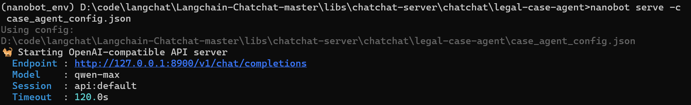
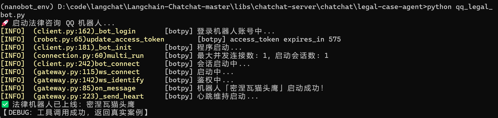
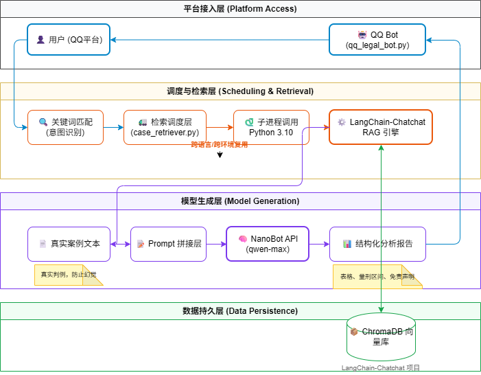
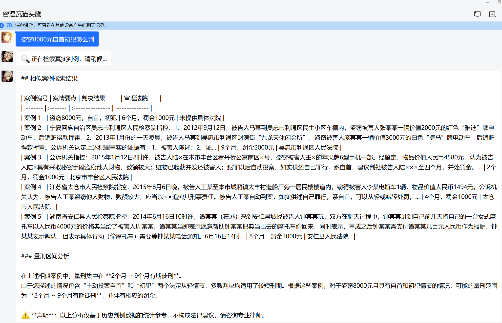

# 基于 NanoBot 的法律智能助手 (Legal Case Agent)

## 项目简介
这是一个基于 NanoBot 框架构建的法律案例分析 Agent，能够根据用户描述的案情，自动从真实判例库中检索相似案例，并生成包含量刑区间、结构化表格和免责声明的分析报告。目前已接入 QQ 平台，用户可直接在聊天中获取服务。

## 核心能力
- **真实判例检索**：调用基于 LangChain-Chatchat 构建的法律知识库，通过 RRF 混合检索和 HyDE 查询扩展，从数万份裁判文书中找到最相似案例。
- **结构化分析报告**：自动生成包含案情对比表格、量刑区间分析和免责声明的专业报告。
- **旧项目复用与解耦**：通过子进程调用 Python 3.10 环境中的 LangChain-Chatchat RAG 引擎，实现新旧技术栈的无损集成，无需重写或升级旧代码。
- **多平台接入**：利用 NanoBot Channel 机制接入 QQ 平台，提供实时对话服务。
- **防幻觉机制**：每次回答前强制执行检索，若检索无结果则明确告知用户“未找到相似案例”，并提醒回答仅为通用参考，而非基于真实判例。
- **错误处理与兜底**：检索超时、子进程失败、API 调用异常均有统一拦截，向用户返回友好提示，避免系统崩溃或泄露内部错误信息。

## 设计决策
- **为什么用子进程而不是直接 import？**  
  旧 RAG 项目依赖 Python 3.10 和特定版本的 LangChain，若强行升级会导致依赖冲突。子进程提供了操作系统级隔离，稳定且易于维护，将来可无缝替换检索引擎。
- **为什么不用框架自动调用工具？**  
  经过多次测试，NanoBot 在当前模型（qwen-turbo）下自动触发 exec 工具不稳定。采用手动编排（检索 → 拼接 prompt → 调用 API）确保每次回答都基于真实案例，避免了 Agent 幻觉。

## 快速开始

### 前置条件
- Python 3.11+ (新环境，用于运行 NanoBot)
- Python 3.10 旧环境 (已有 LangChain-Chatchat 项目，位于 `..\chat` )
- 阿里云 DashScope API Key (或 OpenAI 兼容接口)

### 克隆仓库

```
git clone https://github.com/saul-kirino/legal-case-agent.git
cd legal-case-agent
```

### 安装依赖

```bash
pip install -r requirements.txt  # 包含 nanobot-ai, requests, qq-botpy 等
```

### 启动法律 Agent API

bash

```
nanobot serve -c case_agent_config.json
```



### 使用命令行测试

bash

```
python run_agent.py "盗窃8000元自首初犯怎么判"
```


### 接入 QQ 机器人

1. 在 QQ 开放平台申请机器人，获取 AppID 和 Secret。

2. 复制环境变量模板并填入真实值：
   ```bash
   cp .env.example .env
   # 编辑 .env，填入 QQ_APPID 和 QQ_SECRET

3. 启动机器人：

   ```
   python qq_legal_bot.py
   ```

   

4. 在 QQ 上向机器人发送法律问题即可。

## 项目架构



## 示例对话



## 技术栈

- NanoBot (Agent 框架)
- LangChain-Chatchat (RAG 检索引擎)
- ChromaDB (向量数据库)
- qwen-max (阿里云百炼大模型)
- botpy (QQ 机器人 SDK)

## 项目演示见附件

