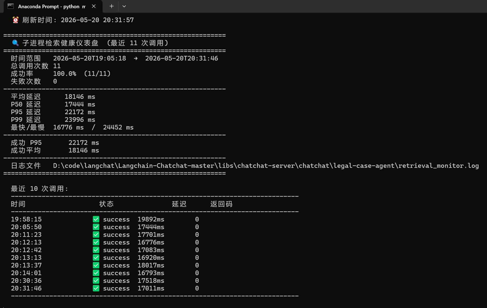
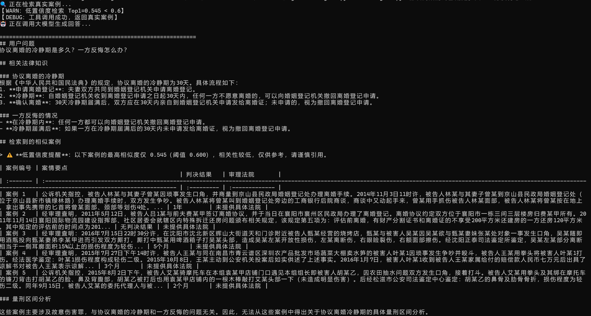

# 基于 NanoBot 的法律智能助手 (Legal Case Agent)

## 项目简介
这是一个基于 NanoBot 框架构建的法律案例分析 Agent，能够根据用户描述的案情，自动从真实判例库中检索相似案例，并生成包含量刑区间、结构化表格和免责声明的分析报告。目前已接入 QQ 平台，用户可直接在聊天中获取服务。

## 核心能力
- **真实判例检索**：调用基于 LangChain-Chatchat 构建的法律知识库，通过 RRF 混合检索和 BGE-Reranker 精排，从数万份裁判文书中找到最相似案例。
- **结构化分析报告**：自动生成包含案情对比表格、量刑区间分析和免责声明的专业报告。
- **旧项目复用与解耦**：通过 subprocess 调用 Python 3.10 环境中的 LangChain-Chatchat RAG 引擎，实现新旧技术栈的无损集成，无需重写或升级旧代码。
- **多平台接入**：基于 botpy SDK 接入 QQ 平台，支持群聊 @ 与私聊双通道。
- **防幻觉机制**：采用手动编排（关键词过滤 → 检索 → Prompt 组装 → LLM 生成），确保每次回答前都执行真实案例检索，避免模型跳过检索直接回答。
- **低置信度自检**：Top1 相似度 < 0.6 时自动在 Prompt 注入告警，防止模型对弱相关案例过度解读。
- **可观测性监控**：每次检索调用记录结构化 JSON Lines 日志，monitor.py 实时展示成功率、P50/P95/P99 延迟。

## 设计决策
- **为什么用子进程而不是直接 import？**  
  旧 RAG 项目依赖 Python 3.10 和特定版本的 LangChain，若强行升级会导致依赖冲突。子进程提供了操作系统级隔离，稳定且易于维护，将来可无缝替换检索引擎。
- **为什么不用 Agent 自主决策？**  
  NanoBot 的 exec 工具在当前模型下调用稳定性不足。采用手动编排（检索 → 组装 Prompt → 调用 LLM）确保每次回答都基于真实案例，避免 Agent 跳过检索直接回答的幻觉风险。这是一种安全优先的设计选择。

## 快速开始

### 前置条件
- Python 3.11+（新环境，用于运行 NanoBot）
- Python 3.10 旧环境（已有 LangChain-Chatchat RAG 引擎）
- 阿里云 DashScope API Key（或 OpenAI 兼容接口）

### 克隆仓库

```
git clone https://github.com/saul-kirino/legal-case-agent.git
cd legal-case-agent
```

### 安装依赖

```bash
pip install -r requirements.txt
```

### 启动 NanoBot API

```bash
nanobot serve -c case_agent_config.json
```


### 使用命令行测试

```bash
python run_agent.py "盗窃8000元自首初犯怎么判"
```

### 接入 QQ 机器人

1. 在 QQ 开放平台申请机器人，获取 AppID 和 Secret。

2. 复制环境变量模板并填入真实值：
   ```bash
   cp .env.example .env
   # 编辑 .env，填入 QQ_APPID 和 QQ_SECRET
   ```

3. 启动机器人：
   ```bash
   python qq_legal_bot.py
   ```

   

4. 在 QQ 上向机器人发送法律问题即可。

## 项目架构

```
┌─────────────────────────────────────────────────────────────────────────┐
│                        ① 用户接入层                                     │
│                                                                         │
│      ┌──────┐          ┌──────────────┐                                │
│      │ 用户 │ ────────→│   QQ 平台    │  群聊 @ 回复 · 私聊双通道      │
│      └──────┘          └──────┬───────┘                                │
│                               │ botpy SDK 事件回调                      │
├───────────────────────────────┼─────────────────────────────────────────┤
│                        ② 消息编排层                                     │
│                               ▼                                         │
│                    ┌──────────────────┐                                 │
│                    │  qq_legal_bot.py  │  规则过滤（18个法律关键词）     │
│                    │  四段式处理链路    │  Ack → 检索 → 组装 → 回复     │
│                    └────────┬─────────┘                                 │
│                             │ asyncio.to_thread() 异步化                 │
├─────────────────────────────┼───────────────────────────────────────────┤
│                        ③ 核心处理层（并行）                              │
│                             │                                           │
│              ┌──────────────┴──────────────┐                           │
│              ▼                              ▼                           │
│  ┌────────────────────┐    ┌────────────────────────┐                  │
│  │  case_retriever.py  │    │  NanoBot (qwen-max)     │                 │
│  │                    │    │                        │                 │
│  │  subprocess 跨环境   │    │  OpenAI 兼容 API       │                 │
│  │  JSON Lines 协议     │    │  结构化 Prompt 生成    │                 │
│  │  低置信度检查 (Top1) │    │  案情表格+量刑区间     │                 │
│  └────────┬───────────┘    └────────────────────────┘                  │
│           │                                                             │
├───────────┼─────────────────────────────────────────────────────────────┤
│           │         ④ 外部系统层                                        │
│           ▼                                                             │
│  ┌────────────────────┐    ┌────────────────────────┐                  │
│  │  Legal-RAG 引擎     │    │  monitor.py 仪表盘      │                 │
│  │                    │    │                        │                 │
│  │  Python 3.10 环境   │    │  成功率 · P50/P95/P99  │                 │
│  │  Faiss + BM25       │    │  错误分类柱状图        │                 │
│  │  BGE-Reranker 精排  │    │  --watch 实时刷新      │                 │
│  └────────────────────┘    └────────────────────────┘                  │
│                                    ▲                                    │
│                                    │ retrieval_monitor.log (JSON Lines) │
│                                    └────────────────────────────────────┘
└─────────────────────────────────────────────────────────────────────────┘
```

**架构说明**：采用手动编排而非 Agent 自主决策。NanoBot 的 exec 工具在 qwen-max 上调用稳定性不足，手动编排确保每次回答前都执行真实案例检索，避免模型跳过检索直接回答的幻觉风险。

| 层 | 组件 | 职责 |
| :--- | :--- | :--- |
| **① 用户接入** | QQ 平台 · botpy SDK | 群聊 @ 回复与私聊双通道消息接收 |
| **② 消息编排** | `qq_legal_bot.py` | 规则过滤 → Ack → 手动编排检索与生成 |
| **③ 核心处理** | `case_retriever.py` + NanoBot (qwen-max) | 并行执行：跨环境检索 + LLM 报告生成 |
| **④ 外部系统** | Legal-RAG + `monitor.py` | 检索引擎 + JSON Lines 监控 |

## 监控与可观测性

### 检索监控日志

每次子进程检索调用自动记录结构化日志到 `retrieval_monitor.log`（JSON Lines 格式），包含时间戳、耗时、返回码、错误类型等字段。

```bash
# 终端实时仪表盘
python monitor.py --watch
```

仪表盘展示：成功率、P50/P95/P99 延迟分布、最快/最慢响应、错误分类柱状图、最近 10 次调用明细。



### 低置信度告警

当检索结果 Top1 相似度 < 0.6 时，系统执行双重保护：

1. **日志记录**：事件写入 `low_confidence.log`（JSON Lines 格式），包含 Top5 分数衰减曲线，便于离线分析阈值合理性。
2. **Prompt 注入**：在发送给 LLM 的 Prompt 开头注入 `⚠️ 低置信度提醒`，防止模型将弱相关案例当作权威依据。

```json
{
  "timestamp": "2026-05-21T15:00:00",
  "query": "协议离婚的冷静期是多久？一方反悔怎么办？",
  "top1_score": 0.423,
  "top_scores": [0.423, 0.391, 0.287, 0.211, 0.198],
  "threshold": 0.6
}
```



## 项目结构

```
legal-case-agent/
├── qq_legal_bot.py          # QQ 机器人入口（botpy SDK + 手动编排）
├── case_retriever.py        # RAG 检索桥接层（subprocess + 低置信度检查）
├── run_agent.py             # 命令行测试入口
├── monitor.py               # 终端健康仪表盘
├── skills/
│   └── legal-case-search.md # NanoBot Skill 定义
├── docs/
│   ├── architecture.png     # 系统架构图
│   ├── start_nanobot.png
│   ├── start_qq_robot.png
│   └── 项目演示.gif
├── .env.example             # QQ 密钥模板
├── .gitignore
└── README.md
```

## 技术栈

- **Agent 框架**：NanoBot（LLM API 服务）
- **RAG 引擎**：LangChain-Chatchat（Faiss + BM25 + BGE-Reranker）
- **大模型**：qwen-max（阿里云百炼）
- **QQ 接入**：botpy SDK
- **跨环境通信**：subprocess + JSON Lines 协议
- **可观测性**：JSON Lines 日志 + monitor.py 终端仪表盘

## 示例对话


## 项目演示

=======
